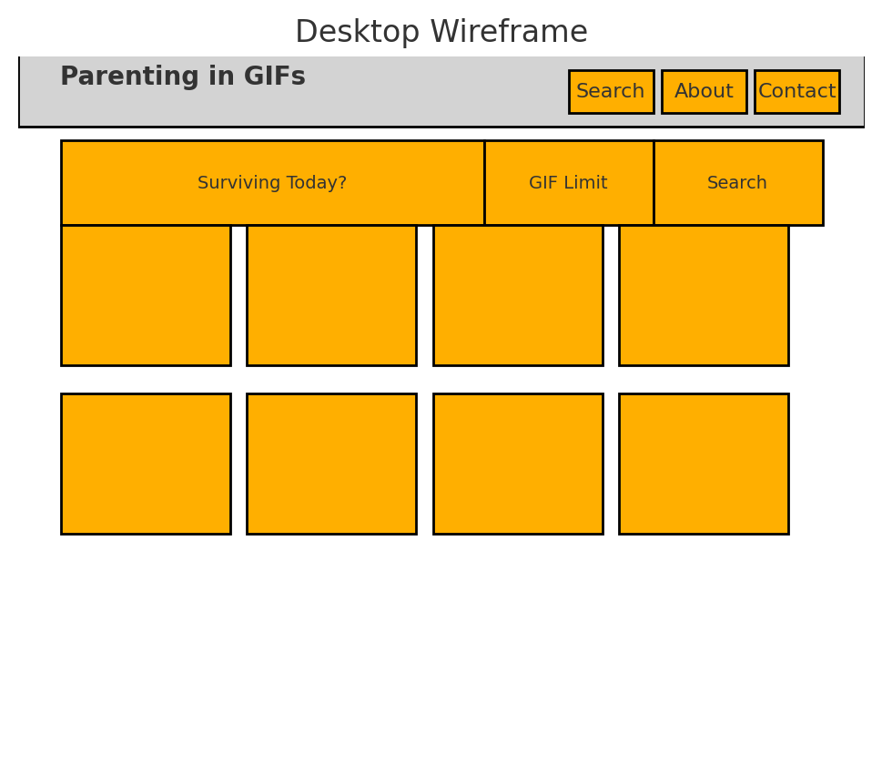
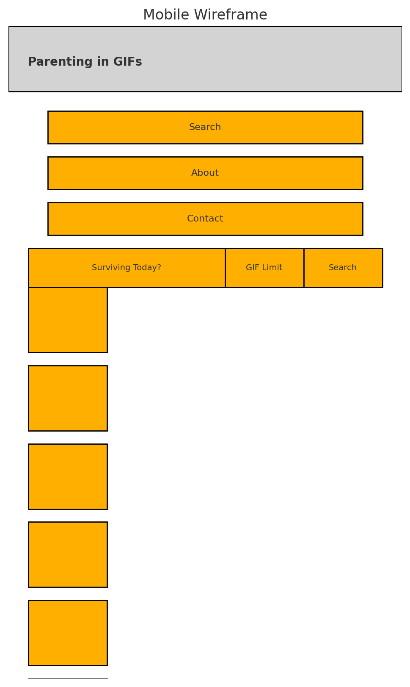

# Parenting in GIFs

Because sometimes the only way to survive the chaos is to laugh at it — in motion.

## 🧠 User Stories

1. As a parent, I want to search for GIFs that match specific parenting moments (e.g. tantrums, bedtime battles), so I can laugh through the chaos.
2. As a tired human, I want to find relatable GIFs quickly, so I can send them to my group chat instead of screaming into the void.
3. As a mobile user, I want the app to work well on my phone, so I can escape while hiding in the bathroom for 3 minutes.
4. As a user, I want to enter the number of GIFs I want to see, so I can control the chaos (unlike my children).

## 👶 Project Description

**Parenting in GIFs** is a single-page GIF search engine that lets you find the perfect GIF to match your current parenting struggle — from diaper blowouts to bedtime breakdowns. Powered by the Giphy API, this app fetches real-time results based on your search terms and displays them in a responsive grid layout, styled with custom SCSS and built entirely in vanilla HTML, CSS, and JavaScript.

## 🚀 How to Use
1. Type what parenting disaster you're currently living through (e.g. `toddler tantrum`, `homework meltdown`, `coffee IV`) in the search box.
2. Choose how many GIFs you want to see.
3. Hit "Search" and enjoy the chaos in animated form.

## 📱 Features
- Live search using the Giphy API
- Custom SCSS styling compiled into clean CSS
- Responsive layout for desktop and mobile
- Flexbox-based GIF grid (no Bootstrap!)
- Mobile-optimized view for hiding from your kids in peace

## 📐 Wireframes

### 🖥️ Desktop

### 📱 Mobile

## 🔧 Technologies Used
- HTML5
- CSS3 (with SCSS preprocessor)
- JavaScript (ES6+)
- Giphy API
- Google Fonts

## 💡 Future Improvements
- Add a “Save My Mood” button to download favorite GIFs
- Include random “Surprise Me” button for spontaneous chaos
- Allow category buttons like “Bedtime”, “Tantrums”, “Mom Needs Coffee”
- Add loader animation while fetching
- Enable dark mode for 2AM scrolls

## 🧑‍💻 Author
Linah Sofi  
[GitHub Profile](https://github.com/linahsofi)

---

Want to change the tone, add screenshots, or make it more sarcastic?